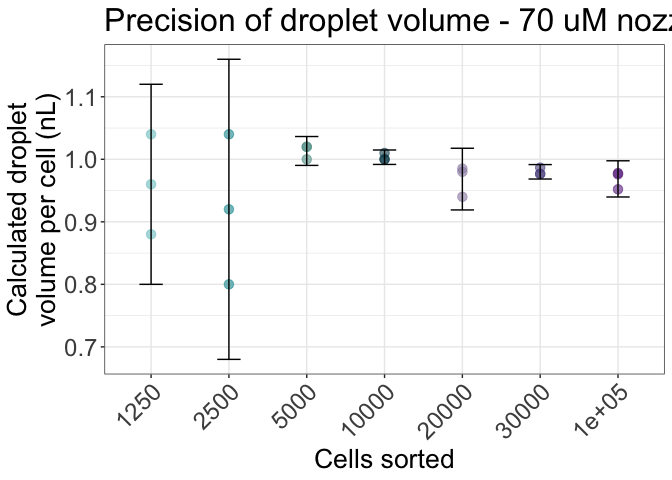
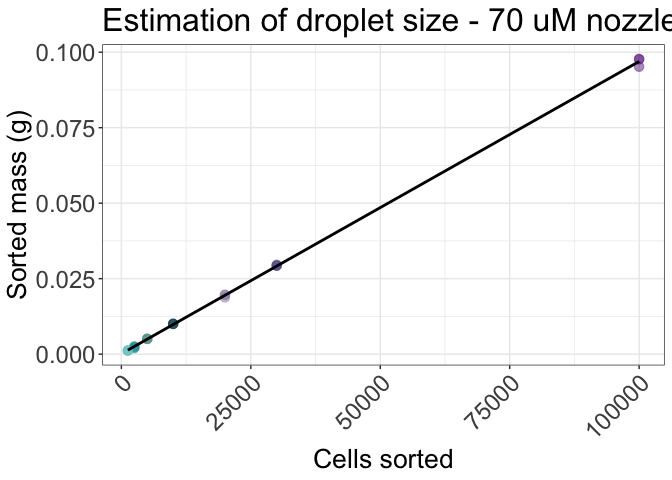
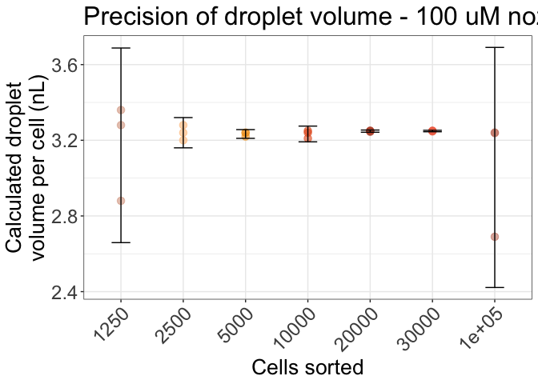
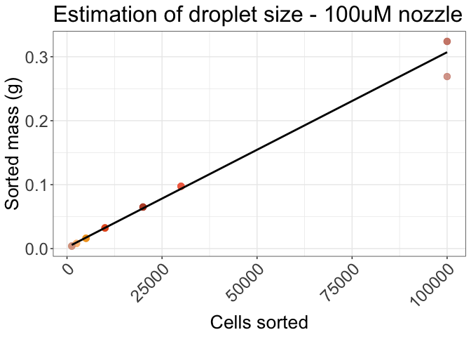

ChipSortPaper_Fig1
================
Anthony R Cillo
2026-05-22

## Load packages

``` r
library(readxl)
library(ggplot2)
library(ggpubr)
library(patchwork)
library(dplyr)
```

    ## 
    ## Attaching package: 'dplyr'

    ## The following objects are masked from 'package:stats':
    ## 
    ##     filter, lag

    ## The following objects are masked from 'package:base':
    ## 
    ##     intersect, setdiff, setequal, union

``` r
library(tidyverse)
```

    ## ── Attaching core tidyverse packages ──────────────────────── tidyverse 2.0.0 ──
    ## ✔ forcats   1.0.0     ✔ stringr   1.5.0
    ## ✔ lubridate 1.9.2     ✔ tibble    3.2.1
    ## ✔ purrr     1.0.2     ✔ tidyr     1.3.0
    ## ✔ readr     2.1.4

    ## ── Conflicts ────────────────────────────────────────── tidyverse_conflicts() ──
    ## ✖ dplyr::filter() masks stats::filter()
    ## ✖ dplyr::lag()    masks stats::lag()
    ## ℹ Use the conflicted package (<http://conflicted.r-lib.org/>) to force all conflicts to become errors

``` r
library(here)
```

    ## here() starts at /Users/ARC85/Desktop/chipsortmanuscript

## Read in files

``` r
df_70 <- read_excel("../01_input/ChipSort_test_weight/ChipSort_test_weight_20260310.xlsx", sheet = "70uM")

df_100 <- read_excel("../01_input/ChipSort_test_weight/ChipSort_test_weight_20260310.xlsx", sheet = "100uM")
```

## Colors to names

``` r
color_70 <- c("#79C6C8","#08979D","#5F9C94","#0F4C5C","#9A8BB0", "#5E548E", "#6A2E8C" )

color_100 <- c("#D8A18B", "#FFC084","#F0A020","#E4571B","#B7492A","#F06A4A","#C97C6A")

color_120 <- c("#C9D8A6", "#8FAF8F", "#5A7D4F","#A6C93C", "#929A68", "#4B5320", "#2E4600")
```

## Figure 1A

``` r
summary_df_70 <- df_70 %>%
  group_by(sorted_amount) %>%
  summarise(
    mean_diff = mean(difference),
    sd_diff = sd(difference),
    .groups = "drop")

summary_df_70$sorted_amount <- factor(summary_df_70$sorted_amount,
                                    levels = levels(df_70$sorted_amount))

df_70$difference <- as.numeric(as.character(df_70$difference))
df_70$sorted_amount <- as.numeric(as.character(df_70$sorted_amount))

df_70$volume_per_cell_ml <- df_70$difference / df_70$sorted_amount

df_70$volume_per_cell_nL <- df_70$volume_per_cell_ml * 1e6

p1 <- ggplot(df_70, aes(x = as.factor(sorted_amount), y = volume_per_cell_nL)) +
  geom_point(size = 3, alpha = 0.6, aes(color = factor(sorted_amount))) +
  stat_summary(fun.data = mean_sdl, geom = "errorbar", width = 0.3) +
  theme_bw() +
  labs(
    x = "Cells sorted",
    y = "Calculated droplet\nvolume per cell (nL)",
    title = "Precision of droplet volume - 70 uM nozzle"
  ) +
  scale_color_manual(values = color_70) +
  theme(axis.text.x = element_text(angle = 45, hjust = 1),
        legend.position = "none",
        axis.title=element_text(size=20),
        axis.text=element_text(size=18),
        title=element_text(size=20))

p2 <- ggplot(df_70) +
  geom_point(aes(x = sorted_amount, y = difference, color = as.factor(sorted_amount)),
             alpha = 0.5, size = 3) +
  geom_smooth(aes(x = sorted_amount, y = difference), method="lm",se = FALSE, color = "black") +
  theme(axis.text.x = element_text(angle = 45, hjust = 1)) +
  scale_y_continuous(labels = scales::label_number(accuracy = 0.001)) +
  theme_bw() +
  labs(
    x = "Cells sorted",
    y = "Sorted mass (g)",
    title = "Estimation of droplet size - 70 uM nozzle"
  ) + 
  scale_color_manual(values = color_70) +
  theme(axis.text.x = element_text(angle = 45, hjust = 1),
        legend.position = "none",
        axis.title=element_text(size=20),
        axis.text=element_text(size=18),
        title=element_text(size=20))

#math 
## 0.1g is ~1e5 cells
## 0.1 / (1e5) = 1e-6 g/cell
## (1e-6 g) * (1e-3 L / g) = 1e-9 L ~ 1 nL
## 1 cell is ~ 1 nL @ 70 uM tip
model <- lm(difference ~ sorted_amount, data = df_70)
summary(model)
```

    ## 
    ## Call:
    ## lm(formula = difference ~ sorted_amount, data = df_70)
    ## 
    ## Residuals:
    ##        Min         1Q     Median         3Q        Max 
    ## -0.0017330 -0.0001341  0.0001333  0.0001951  0.0008670 
    ## 
    ## Coefficients:
    ##                Estimate Std. Error t value Pr(>|t|)    
    ## (Intercept)   1.240e-04  1.474e-04   0.841    0.411    
    ## sorted_amount 9.681e-07  3.648e-09 265.376   <2e-16 ***
    ## ---
    ## Signif. codes:  0 '***' 0.001 '**' 0.01 '*' 0.05 '.' 0.1 ' ' 1
    ## 
    ## Residual standard error: 0.0005422 on 19 degrees of freedom
    ## Multiple R-squared:  0.9997, Adjusted R-squared:  0.9997 
    ## F-statistic: 7.042e+04 on 1 and 19 DF,  p-value: < 2.2e-16

``` r
coef(model)[2] * 1e-3 * 1e9
```

    ## sorted_amount 
    ##     0.9680896

## Figure 1B

``` r
summary_df_100 <- df_100 %>%
  group_by(sorted_amount) %>%
  summarise(
    mean_diff = mean(difference),
    sd_diff = sd(difference),
    .groups = "drop")


summary_df_100$sorted_amount <- factor(summary_df_100$sorted_amount,
                                    levels = levels(df_100$sorted_amount))


df_100$difference <- as.numeric(as.character(df_100$difference))
df_100$sorted_amount <- as.numeric(as.character(df_100$sorted_amount))

df_100$volume_per_cell_ml <- df_100$difference / df_100$sorted_amount

df_100$volume_per_cell_nL <- df_100$volume_per_cell_ml * 1e6

p3 <- ggplot(df_100, aes(x = factor(sorted_amount), y = volume_per_cell_nL)) +
  geom_point(size = 3, alpha = 0.6, aes(color = factor(sorted_amount))) +
  stat_summary(fun.data = mean_sdl, geom = "errorbar", width = 0.3) +
  theme_bw() +
  labs(
    x = "Cells sorted",
    y = "Calculated droplet\nvolume per cell (nL)",
    title = "Precision of droplet volume - 100 uM nozzle"
  ) +
  scale_color_manual(values = color_100) +
  theme(axis.text.x = element_text(angle = 45, hjust = 1),
        legend.position = "none",
        axis.title=element_text(size=20),
        axis.text=element_text(size=18),
        title=element_text(size=20))

p4 <- ggplot(df_100, aes(x = sorted_amount, y = difference)) +
  geom_point(size = 3, alpha = 0.7, aes(color = factor(sorted_amount))) +
  geom_smooth(method = "lm", se = FALSE, color = "black") +
  theme_bw() +
  labs(
    x = "Cells sorted",
    y = "Sorted mass (g)",
    title = "Estimation of droplet size - 100uM nozzle") +
  scale_color_manual(values = color_100) +
  theme(axis.text.x = element_text(angle = 45, hjust = 1),
        legend.position = "none",
        axis.title=element_text(size=20),
        axis.text=element_text(size=18),
        title=element_text(size=20))

#math 
## 0.3g is ~1e5 cells
## 0.3 / (1e5) = 3e-6 g/cell
## (3e-6 g) * (1e-3 L / g) = 3e-9 L ~ 3 nL
## 1 cell is ~ 3 nL @ 100 uM tip
model <- lm(difference ~ sorted_amount, data = df_100)
summary(model)
```

    ## 
    ## Call:
    ## lm(formula = difference ~ sorted_amount, data = df_100)
    ## 
    ## Residuals:
    ##       Min        1Q    Median        3Q       Max 
    ## -0.038093 -0.001489 -0.000374  0.002013  0.017007 
    ## 
    ## Coefficients:
    ##                Estimate Std. Error t value Pr(>|t|)    
    ## (Intercept)   1.960e-03  2.857e-03   0.686    0.501    
    ## sorted_amount 3.051e-06  7.070e-08  43.156   <2e-16 ***
    ## ---
    ## Signif. codes:  0 '***' 0.001 '**' 0.01 '*' 0.05 '.' 0.1 ' ' 1
    ## 
    ## Residual standard error: 0.01051 on 19 degrees of freedom
    ## Multiple R-squared:  0.9899, Adjusted R-squared:  0.9894 
    ## F-statistic:  1862 on 1 and 19 DF,  p-value: < 2.2e-16

``` r
coef(model)[2] * 1e-3 * 1e9
```

    ## sorted_amount 
    ##      3.051327

## Visualize results

``` r
p1
```

<!-- -->

``` r
p2
```

    ## `geom_smooth()` using formula = 'y ~ x'

<!-- -->

``` r
p3
```

<!-- -->

``` r
p4
```

    ## `geom_smooth()` using formula = 'y ~ x'

<!-- -->

## Session info

``` r
sessionInfo()
```

    ## R version 4.3.1 (2023-06-16)
    ## Platform: aarch64-apple-darwin20 (64-bit)
    ## Running under: macOS 26.1
    ## 
    ## Matrix products: default
    ## BLAS:   /Library/Frameworks/R.framework/Versions/4.3-arm64/Resources/lib/libRblas.0.dylib 
    ## LAPACK: /Library/Frameworks/R.framework/Versions/4.3-arm64/Resources/lib/libRlapack.dylib;  LAPACK version 3.11.0
    ## 
    ## locale:
    ## [1] en_US.UTF-8/en_US.UTF-8/en_US.UTF-8/C/en_US.UTF-8/en_US.UTF-8
    ## 
    ## time zone: America/New_York
    ## tzcode source: internal
    ## 
    ## attached base packages:
    ## [1] stats     graphics  grDevices utils     datasets  methods   base     
    ## 
    ## other attached packages:
    ##  [1] here_1.0.1      lubridate_1.9.2 forcats_1.0.0   stringr_1.5.0  
    ##  [5] purrr_1.0.2     readr_2.1.4     tidyr_1.3.0     tibble_3.2.1   
    ##  [9] tidyverse_2.0.0 dplyr_1.1.4     patchwork_1.1.3 ggpubr_0.6.0   
    ## [13] ggplot2_3.4.4   readxl_1.4.3   
    ## 
    ## loaded via a namespace (and not attached):
    ##  [1] gtable_0.3.3      xfun_0.40         htmlwidgets_1.6.2 rstatix_0.7.2    
    ##  [5] lattice_0.21-8    tzdb_0.4.0        vctrs_0.6.5       tools_4.3.1      
    ##  [9] generics_0.1.3    fansi_1.0.4       highr_0.10        cluster_2.1.4    
    ## [13] pkgconfig_2.0.3   Matrix_1.6-5      data.table_1.14.8 checkmate_2.3.2  
    ## [17] lifecycle_1.0.4   farver_2.1.1      compiler_4.3.1    munsell_0.5.0    
    ## [21] carData_3.0-5     htmltools_0.5.8.1 yaml_2.3.8        htmlTable_2.4.3  
    ## [25] Formula_1.2-5     pillar_1.9.0      car_3.1-2         Hmisc_5.2-0      
    ## [29] rpart_4.1.19      abind_1.4-5       nlme_3.1-162      tidyselect_1.2.0 
    ## [33] digest_0.6.33     stringi_1.7.12    splines_4.3.1     labeling_0.4.2   
    ## [37] rprojroot_2.0.3   fastmap_1.1.1     grid_4.3.1        colorspace_2.1-0 
    ## [41] cli_3.6.2         magrittr_2.0.3    base64enc_0.1-3   utf8_1.2.3       
    ## [45] broom_1.0.5       foreign_0.8-84    withr_2.5.0       scales_1.2.1     
    ## [49] backports_1.4.1   timechange_0.2.0  rmarkdown_2.24    nnet_7.3-19      
    ## [53] gridExtra_2.3     ggsignif_0.6.4    cellranger_1.1.0  hms_1.1.3        
    ## [57] evaluate_0.21     knitr_1.43        mgcv_1.8-42       rlang_1.1.6      
    ## [61] glue_1.6.2        rstudioapi_0.15.0 R6_2.5.1
