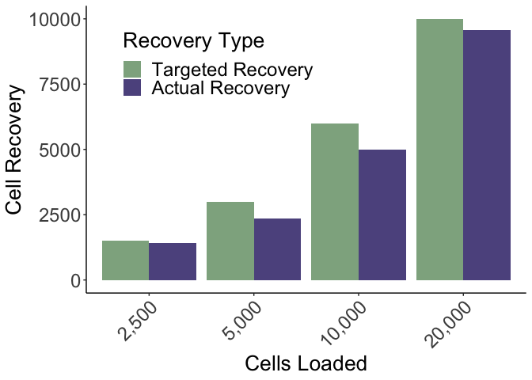
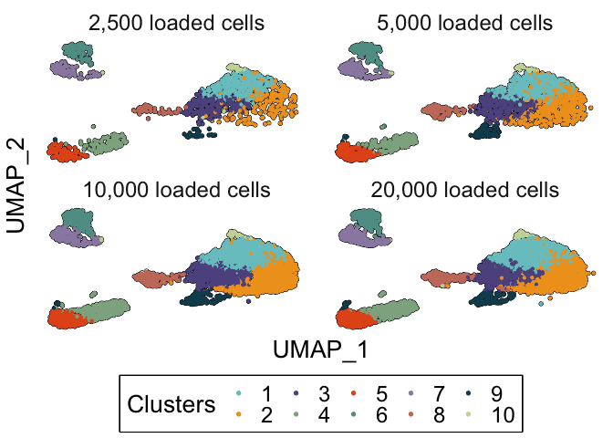
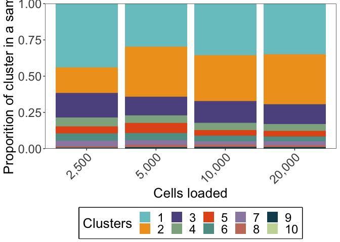
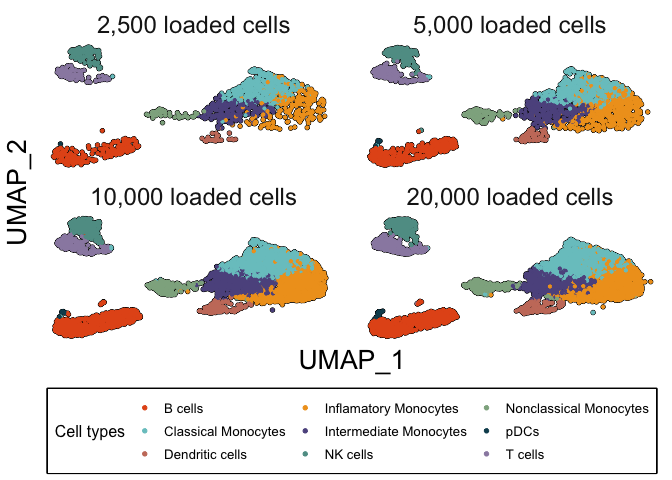
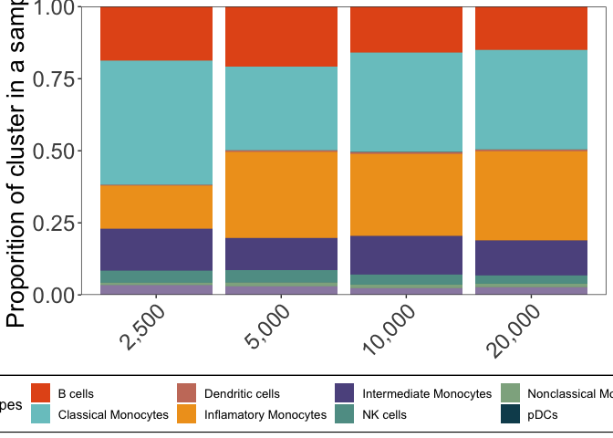

ChipSortPaper_Fig3
================
Anthony R Cillo
2026-05-22

## Load packages

``` r
library(readxl)
library(ggplot2)
library(ggpubr)
library(patchwork)
library(dplyr)
```

    ## 
    ## Attaching package: 'dplyr'

    ## The following objects are masked from 'package:stats':
    ## 
    ##     filter, lag

    ## The following objects are masked from 'package:base':
    ## 
    ##     intersect, setdiff, setequal, union

``` r
library(tidyverse)
```

    ## ── Attaching core tidyverse packages ──────────────────────── tidyverse 2.0.0 ──
    ## ✔ forcats   1.0.0     ✔ stringr   1.5.0
    ## ✔ lubridate 1.9.2     ✔ tibble    3.2.1
    ## ✔ purrr     1.0.2     ✔ tidyr     1.3.0
    ## ✔ readr     2.1.4

    ## ── Conflicts ────────────────────────────────────────── tidyverse_conflicts() ──
    ## ✖ dplyr::filter() masks stats::filter()
    ## ✖ dplyr::lag()    masks stats::lag()
    ## ℹ Use the conflicted package (<http://conflicted.r-lib.org/>) to force all conflicts to become errors

``` r
library(qs)
```

    ## qs 0.27.3. Announcement: https://github.com/qsbase/qs/issues/103

``` r
library(Seurat)
```

    ## Warning: package 'Seurat' was built under R version 4.3.3

    ## Loading required package: SeuratObject

    ## Warning: package 'SeuratObject' was built under R version 4.3.3

    ## Loading required package: sp
    ## The legacy packages maptools, rgdal, and rgeos, underpinning the sp package,
    ## which was just loaded, will retire in October 2023.
    ## Please refer to R-spatial evolution reports for details, especially
    ## https://r-spatial.org/r/2023/05/15/evolution4.html.
    ## It may be desirable to make the sf package available;
    ## package maintainers should consider adding sf to Suggests:.
    ## The sp package is now running under evolution status 2
    ##      (status 2 uses the sf package in place of rgdal)
    ## 
    ## Attaching package: 'SeuratObject'
    ## 
    ## The following objects are masked from 'package:base':
    ## 
    ##     intersect, t

``` r
library(here)
```

    ## here() starts at /Users/ARC85/Desktop/chipsortmanuscript

## Load data

``` r
df <- read_excel("../01_input/ChipSort_data_20260310.xlsx", sheet = "sort")

ser <- qs::qread("../01_input/ser_hd9.qs")
```

## Establish color scheme

``` r
## Refined based on cell types refinements below
my_colors <- c(
"Classical Monocytes" = "#79C6C8",
"Inflamatory Monocytes" = "#F0A020",
"Intermediate Monocytes"= "#5E548E", 
"B cells" = "#E4571B", 
"NK cells" = "#5F9C94", 
"T cells" = "#9A8BB0", 
"Nonclassical Monocytes" = "#8FAF8F",
"Dendritic cells" = "#C97C6A",
"pDCs" = "#0F4C5C")


#color palette
colors_pal <- c(
"#79C6C8",
"#F0A020",
"#5E548E",
"#8FAF8F",
"#E4571B",
"#5F9C94",
"#9A8BB0",
"#C97C6A",
"#0F4C5C",
"#C9D8A6",
"#F06A4A",
"#6A2E8C",
"#5A7D4F",
"#D8A18B",
"#B7492A")
```

## Plot expected vs actual recovery from chip sorting

``` r
df_hd9 <- df 

df_long <- df_hd9 %>%
  pivot_longer(
    cols = c(target_recovery, pre_filt_recovery),
    names_to = "recovery_type",
    values_to = "recovery")

df_long$cells_loaded <- recode(df_long$cells_loaded,
                               `2500`="2,500",
                               `5000`="5,000",
                               `10000`="10,000",
                               `20000`="20,000")

df_long$cells_loaded <- factor(
  df_long$cells_loaded,
  levels=c("2,500","5,000","10,000","20,000")
)

df_long$recovery_type <- factor(
  df_long$recovery_type,
  levels = c("target_recovery", "pre_filt_recovery"))

p1 <- df_long %>%
  filter(sort_type=="sort") %>% 
  ggplot(., aes(x = cells_loaded, y = recovery, fill = recovery_type)) +
  geom_bar(stat = "identity", position = position_dodge(width = 0.9)) +
  theme_classic() +
  labs(
    x = "Cells Loaded",
    y = "Cell Recovery",
    fill = "Recovery Type") +
  scale_fill_manual(values = c("#8FAF8F","#5E548E"),
  labels = c("Targeted Recovery", "Actual Recovery")) +
  theme(axis.text.x = element_text(angle = 45, hjust = 1),
        axis.title=element_text(size=20),
        axis.text=element_text(size=18),
        title=element_text(size=20),
        legend.text = element_text(size=18),
        legend.position=c(0.3,0.8)
        )
```

## Refine dataset for plotting

Note that we will remove a few clusters for being doublets, and we will
refine cell type annotations across the dataset.

``` r
ser$sample_name <- factor(
  ser$sample_name,
  levels = c("2.5K_Sort_2","5K_Sort_2", "10K_Sort_2", "20K_Sort_2"))

## extract UMAP and metadata for pretty plotting
umap <- Embeddings(ser,reduction="umap_int")
meta <- ser@meta.data

umap_meta <- cbind(umap,meta)
colnames(umap_meta)[1:2] <- paste("UMAP_",1:2,sep="")
umap_meta <- umap_meta %>%
  filter(!grepl("9|11",RNA_snn_res.0.3)) %>%
  mutate(refined_sample_names=recode(
    sample_name,
    `2.5K_Sort_2`="2,500 loaded cells",
    `5K_Sort_2`="5,000 loaded cells",
    `10K_Sort_2`="10,000 loaded cells",
    `20K_Sort_2`="20,000 loaded cells"
  )) %>%
  mutate(`Cells loaded`=recode(
    sample_name,
    `2.5K_Sort_2`="2,500",
    `5K_Sort_2`="5,000",
    `10K_Sort_2`="10,000",
    `20K_Sort_2`="20,000"
  )) %>%
  mutate(`Cell types`=cluster_anno) %>%
  mutate(`Cell types`=recode(`Cell types`,
    `CD8+ T Cells`="T cells",
    `cDC2`="Dendritic cells",
    `Mature B Cells`="B cells",
    `Naive B Cells`="B cells",
    `NK Cells`="NK cells",
    `Plasma Cells`="B cells"
  )) %>%
  mutate(`Cell types`=ifelse(RNA_snn_res.0.3==8 & UMAP_1< -5, "pDCs",`Cell types`)) %>% 
  mutate(Clusters=RNA_snn_res.0.3) %>%
  mutate(Clusters=droplevels(Clusters)) %>%
  mutate(Clusters=as.factor(as.numeric(Clusters)))
```

## UMAPs from chip sorting - cell titration and cluster frequencies

``` r
p2 <- umap_meta %>%
  ggplot(.) +
  geom_point(aes(x=UMAP_1,y=UMAP_2),colour="black",size=1.2) +
  geom_point(aes(x=UMAP_1,y=UMAP_2,colour=Clusters),size=0.8) +
  scale_colour_manual(values=colors_pal) +
  theme_bw() +
  theme(
    panel.background = element_blank(),
    panel.grid = element_blank(),
    panel.border = element_blank(),
    axis.text = element_blank(),
    axis.ticks = element_blank(),
    strip.background = element_blank(),
    strip.text = element_text(size=18),
    axis.title = element_text(size=20),
    legend.text = element_text(size=18),
    legend.title = element_text(size=20),
    legend.position = "bottom",
    legend.box.background = element_rect(color = "black", linewidth = 1)
  ) +
  guides(colour = guide_legend(override.aes = list(size=1.2))) +
  facet_wrap(~refined_sample_names)

p3 <- umap_meta %>%
  select(`Cells loaded`,Clusters) %>%
  group_by(`Cells loaded`) %>%
  mutate(total_cells=n()) %>%
  group_by(`Cells loaded`,Clusters) %>%
  mutate(cells_per_clust=n()) %>%
  ungroup() %>%
  mutate(`Cell proportion`=cells_per_clust/total_cells) %>%
  ggplot(.,aes(x=`Cells loaded`,y=`Cell proportion`,fill=Clusters)) +
  geom_col(position="fill") +
  scale_fill_manual(values=colors_pal) +
  xlab("Cells loaded") +
  ylab("Proporition of cluster in a sample") +
  scale_y_continuous(expand = expansion(mult = c(0, 0))) +
  theme_bw() +
  theme(
    panel.background = element_blank(),
    panel.grid = element_blank(),
    axis.title = element_text(size=20),
    axis.text = element_text(size=18),
    legend.text = element_text(size=18),
    legend.title = element_text(size=20),
    legend.position = "bottom",
    legend.box.background = element_rect(color = "black", linewidth = 1),
    axis.text.x=element_text(angle=45,hjust=T)
  )
```

## UMAPs from chip sorting - cell titration and cell type frequencies

``` r
p4 <- umap_meta %>%
  ggplot(.) +
  geom_point(aes(x=UMAP_1,y=UMAP_2),colour="black",size=1.2) +
  geom_point(aes(x=UMAP_1,y=UMAP_2,colour=`Cell types`),size=0.8) +
  scale_colour_manual(values=my_colors) +
  theme_bw() +
  theme(
    panel.background = element_blank(),
    panel.grid = element_blank(),
    panel.border = element_blank(),
    axis.text = element_blank(),
    axis.ticks = element_blank(),
    strip.background = element_blank(),
    strip.text = element_text(size=18),
    axis.title = element_text(size=20),
    legend.text = element_text(size=10),
    legend.title = element_text(size=12),
    legend.position="bottom",
    legend.box.background = element_rect(color = "black", linewidth = 1)
  ) +
  guides(colour = guide_legend(nrow=3,override.aes = list(size=1.2))) +
  facet_wrap(~refined_sample_names)

p5 <- umap_meta %>%
  select(`Cells loaded`,`Cell types`) %>%
  group_by(`Cells loaded`) %>%
  mutate(total_cells=n()) %>%
  group_by(`Cells loaded`,`Cell types`) %>%
  mutate(cells_per_clust=n()) %>%
  ungroup() %>%
  mutate(`Cell proportion`=cells_per_clust/total_cells) %>%
  ggplot(.,aes(x=`Cells loaded`,y=`Cell proportion`,fill=`Cell types`)) +
  geom_col(position="fill") +
  scale_fill_manual(values=my_colors) +
  ylab("Proporition of cluster in a sample") +
  scale_y_continuous(expand = expansion(mult = c(0, 0))) +
  theme_bw() +
  theme(
    axis.title.x=element_blank(),
    panel.background = element_blank(),
    panel.grid = element_blank(),
    axis.title = element_text(size=20),
    axis.text = element_text(size=18),
    legend.text = element_text(size=10),
    legend.title = element_text(size=12),
    legend.position = "bottom",
    legend.box.background = element_rect(color = "black", linewidth = 1),
    axis.text.x=element_text(angle=45,hjust=TRUE)
  )
```

## Create plot

``` r
p1
```

<!-- -->

``` r
p2
```

<!-- -->

``` r
p3
```

<!-- -->

``` r
p4 
```

<!-- -->

``` r
p5
```

<!-- -->

## Session info

``` r
sessionInfo()
```

    ## R version 4.3.1 (2023-06-16)
    ## Platform: aarch64-apple-darwin20 (64-bit)
    ## Running under: macOS 26.1
    ## 
    ## Matrix products: default
    ## BLAS:   /Library/Frameworks/R.framework/Versions/4.3-arm64/Resources/lib/libRblas.0.dylib 
    ## LAPACK: /Library/Frameworks/R.framework/Versions/4.3-arm64/Resources/lib/libRlapack.dylib;  LAPACK version 3.11.0
    ## 
    ## locale:
    ## [1] en_US.UTF-8/en_US.UTF-8/en_US.UTF-8/C/en_US.UTF-8/en_US.UTF-8
    ## 
    ## time zone: America/New_York
    ## tzcode source: internal
    ## 
    ## attached base packages:
    ## [1] stats     graphics  grDevices utils     datasets  methods   base     
    ## 
    ## other attached packages:
    ##  [1] here_1.0.1         Seurat_5.1.0       SeuratObject_5.0.2 sp_2.0-0          
    ##  [5] qs_0.27.3          lubridate_1.9.2    forcats_1.0.0      stringr_1.5.0     
    ##  [9] purrr_1.0.2        readr_2.1.4        tidyr_1.3.0        tibble_3.2.1      
    ## [13] tidyverse_2.0.0    dplyr_1.1.4        patchwork_1.1.3    ggpubr_0.6.0      
    ## [17] ggplot2_3.4.4      readxl_1.4.3      
    ## 
    ## loaded via a namespace (and not attached):
    ##   [1] RColorBrewer_1.1-3     rstudioapi_0.15.0      jsonlite_1.8.9        
    ##   [4] magrittr_2.0.3         spatstat.utils_3.0-3   farver_2.1.1          
    ##   [7] rmarkdown_2.24         vctrs_0.6.5            ROCR_1.0-11           
    ##  [10] spatstat.explore_3.2-1 rstatix_0.7.2          htmltools_0.5.8.1     
    ##  [13] broom_1.0.5            cellranger_1.1.0       sctransform_0.4.1     
    ##  [16] parallelly_1.36.0      KernSmooth_2.23-21     htmlwidgets_1.6.2     
    ##  [19] ica_1.0-3              plyr_1.8.8             plotly_4.10.2         
    ##  [22] zoo_1.8-12             igraph_1.5.1           mime_0.12             
    ##  [25] lifecycle_1.0.4        pkgconfig_2.0.3        Matrix_1.6-5          
    ##  [28] R6_2.5.1               fastmap_1.1.1          fitdistrplus_1.1-11   
    ##  [31] future_1.33.0          shiny_1.7.5            digest_0.6.33         
    ##  [34] colorspace_2.1-0       rprojroot_2.0.3        tensor_1.5            
    ##  [37] RSpectra_0.16-1        irlba_2.3.7            labeling_0.4.2        
    ##  [40] progressr_0.14.0       fansi_1.0.4            spatstat.sparse_3.0-2 
    ##  [43] timechange_0.2.0       polyclip_1.10-4        httr_1.4.7            
    ##  [46] abind_1.4-5            compiler_4.3.1         withr_2.5.0           
    ##  [49] backports_1.4.1        carData_3.0-5          fastDummies_1.7.3     
    ##  [52] highr_0.10             ggsignif_0.6.4         MASS_7.3-60           
    ##  [55] tools_4.3.1            lmtest_0.9-40          httpuv_1.6.11         
    ##  [58] future.apply_1.11.0    goftest_1.2-3          glue_1.6.2            
    ##  [61] nlme_3.1-162           promises_1.2.1         grid_4.3.1            
    ##  [64] Rtsne_0.16             cluster_2.1.4          reshape2_1.4.4        
    ##  [67] generics_0.1.3         gtable_0.3.3           spatstat.data_3.0-1   
    ##  [70] tzdb_0.4.0             data.table_1.14.8      RApiSerialize_0.1.4   
    ##  [73] hms_1.1.3              stringfish_0.16.0      car_3.1-2             
    ##  [76] utf8_1.2.3             spatstat.geom_3.2-4    RcppAnnoy_0.0.21      
    ##  [79] ggrepel_0.9.3          RANN_2.6.1             pillar_1.9.0          
    ##  [82] spam_2.9-1             RcppHNSW_0.5.0         later_1.3.1           
    ##  [85] splines_4.3.1          lattice_0.21-8         deldir_1.0-9          
    ##  [88] survival_3.5-5         tidyselect_1.2.0       miniUI_0.1.1.1        
    ##  [91] pbapply_1.7-2          knitr_1.43             gridExtra_2.3         
    ##  [94] scattermore_1.2        xfun_0.40              matrixStats_1.0.0     
    ##  [97] stringi_1.7.12         lazyeval_0.2.2         yaml_2.3.8            
    ## [100] evaluate_0.21          codetools_0.2-19       cli_3.6.2             
    ## [103] uwot_0.1.16            RcppParallel_5.1.10    xtable_1.8-4          
    ## [106] reticulate_1.40.0      munsell_0.5.0          Rcpp_1.0.11           
    ## [109] spatstat.random_3.1-5  globals_0.16.2         png_0.1-8             
    ## [112] parallel_4.3.1         ellipsis_0.3.2         dotCall64_1.0-2       
    ## [115] listenv_0.9.0          viridisLite_0.4.2      scales_1.2.1          
    ## [118] ggridges_0.5.4         leiden_0.4.3           rlang_1.1.6           
    ## [121] cowplot_1.1.1
