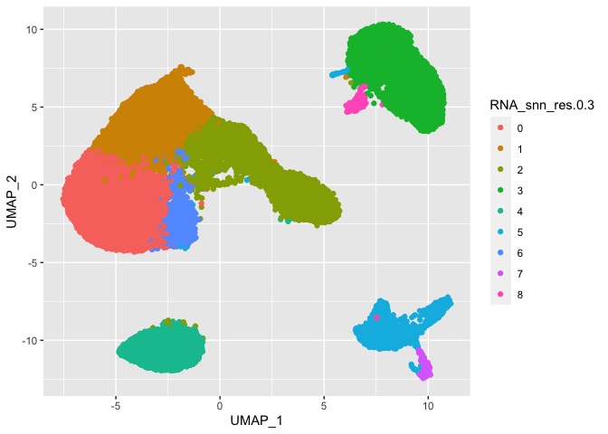
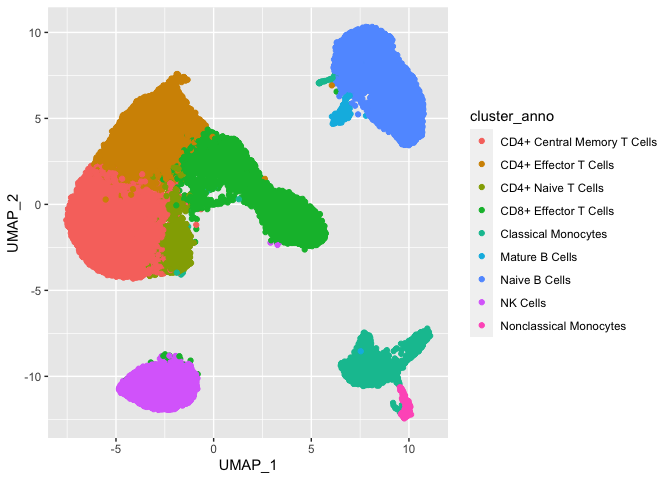
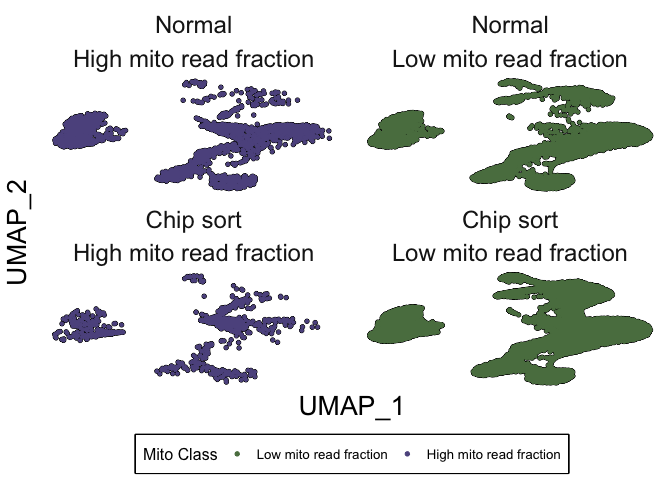
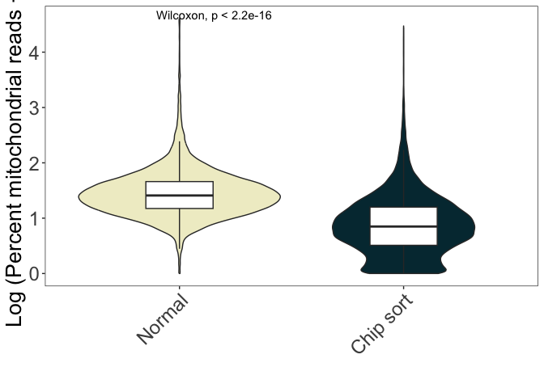
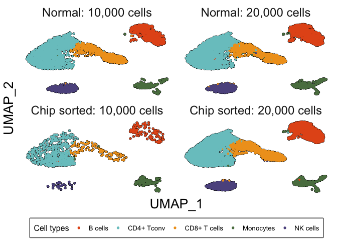
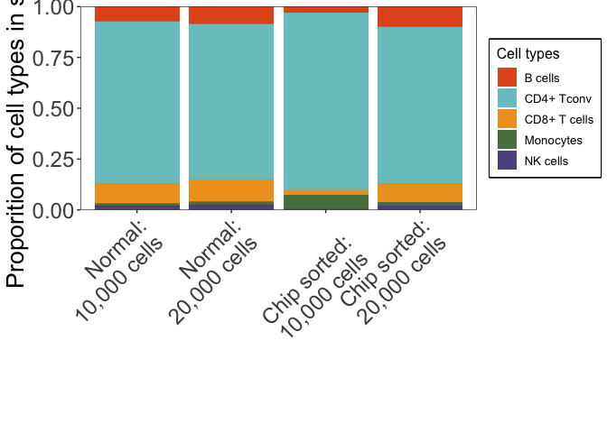
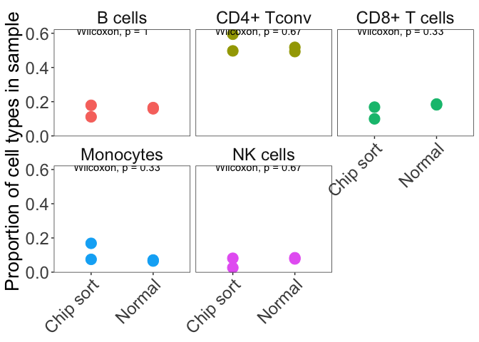

ChipSortPaper_Fig4
================
Anthony R Cillo
2026-05-22

## Set up

``` r
library(ggplot2)
library(ggpubr)
library(patchwork)
library(tidyverse)
```

    ## ── Attaching core tidyverse packages ──────────────────────── tidyverse 2.0.0 ──
    ## ✔ dplyr     1.1.4     ✔ readr     2.1.4
    ## ✔ forcats   1.0.0     ✔ stringr   1.5.0
    ## ✔ lubridate 1.9.2     ✔ tibble    3.2.1
    ## ✔ purrr     1.0.2     ✔ tidyr     1.3.0
    ## ── Conflicts ────────────────────────────────────────── tidyverse_conflicts() ──
    ## ✖ dplyr::filter() masks stats::filter()
    ## ✖ dplyr::lag()    masks stats::lag()
    ## ℹ Use the conflicted package (<http://conflicted.r-lib.org/>) to force all conflicts to become errors

``` r
library(here)
```

    ## here() starts at /Users/ARC85/Desktop/chipsortmanuscript

## Load data

``` r
ser_hd1 <- readRDS("../01_input/HD1_norm_vs_chip_10k_20k_metadata_260406.rds")

ser_hd1_unfil <- readRDS("../01_input/chip_sort_unfiltered_umap_meta_260508.rds")
```

## Establish color scheme

``` r
my_colors <- c(
"CD4+ Tconv" = "#79C6C8",
"CD8+ T cells" = "#F0A020", 
"B cells" = "#E4571B", 
"NK cells" = "#5E548E", 
"Monocytes"= "#5A7D4F"
)

colors_pal <- c(
"#0F4C5C",
"#79C6C8",
"#F0A020",
"#E4571B",
"#B7492A",
"#5A7D4F",
"#5E548E",
"#6A2E8C", 
"#A6C93C")

my_colors2 <- c("#5A7D4F","#5E548E")

my_colors3 <- c("#F0EDCC","#02343F")
```

## Plot mito data

``` r
colnames(ser_hd1_unfil)[1:2] <- c("UMAP_1","UMAP_2")

p1 <- ser_hd1_unfil %>%
  mutate(sort_type=recode(sort_type,`Sort`="Chip sort")) %>%
  mutate(sort_type=as.factor(sort_type)) %>%
  mutate(sort_type=factor(sort_type,levels=c("Normal","Chip sort"))) %>%
  mutate(mito_cut=as.factor(ifelse(percent.mt>5,"High mito read fraction","Low mito read fraction"))) %>%
  mutate(`Mito Class`=factor(mito_cut,levels=c("Low mito read fraction","High mito read fraction"))) %>% 
  ggplot(.) +
  geom_point(aes(x=UMAP_1,y=UMAP_2),colour="black",size=1.2) +
  geom_point(aes(x=UMAP_1,y=UMAP_2,colour=`Mito Class`),size=0.8) +
  theme_bw() +
  scale_color_manual(values=my_colors2) +
  theme(
    panel.background = element_blank(),
    panel.grid = element_blank(),
    panel.border = element_blank(),
    axis.text = element_blank(),
    axis.ticks = element_blank(),
    strip.background = element_blank(),
    strip.text = element_text(size=18),
    axis.title = element_text(size=20),
    legend.text = element_text(size=10),
    legend.title = element_text(size=12),
    legend.position = "bottom",
    legend.box.background = element_rect(color = "black", linewidth = 1)
  ) +
  guides(colour = guide_legend(override.aes = list(size=1.2))) +
  facet_wrap(~sort_type+mito_cut)

p2 <- ser_hd1_unfil %>%
  mutate(sort_type=recode(sort_type,`Sort`="Chip sort")) %>%
  mutate(sort_type=as.factor(sort_type)) %>%
  mutate(sort_type=factor(sort_type,levels=c("Normal","Chip sort"))) %>%
  mutate(percent.mt=log1p(percent.mt)) %>% 
  ggplot(.,aes(x=sort_type,y=percent.mt)) +
  geom_violin(aes(x=sort_type,y=percent.mt,fill=sort_type)) +
  geom_boxplot(aes(x=sort_type,y=percent.mt),width=0.3,outlier.shape = NA) +
  scale_fill_manual(values=my_colors3) +
  theme_bw() +
  theme(
    panel.background = element_blank(),
    panel.grid = element_blank(),
    strip.background = element_blank(),
    strip.text = element_text(size=18),
    axis.title = element_text(size=20),
    legend.text = element_text(size=18),
    legend.title = element_text(size=20),
    axis.text.y = element_text(size=18),
    axis.text.x = element_text(size=18,angle=45,hjust=TRUE),
    legend.position = "none"
  ) +
  xlab("") +
  ylab("Log (Percent mitochondrial reads + 1)") +
  stat_compare_means()
```

## Refine metadata

``` r
ser_hd1 %>%
  ggplot(.,aes(x=UMAP_1,y=UMAP_2,colour=RNA_snn_res.0.3)) +
  geom_point()
```

<!-- -->

``` r
ser_hd1 %>%
  ggplot(.,aes(x=UMAP_1,y=UMAP_2,colour=cluster_anno)) +
  geom_point()
```

<!-- -->

``` r
ser_hd1 <- ser_hd1 %>%
  mutate(refined_cluster_anno=recode(cluster_anno,
                                    "CD4+ Central Memory T Cells"="CD4+ Tconv",
                                    "CD4+ Effector T Cells"="CD4+ Tconv",
                                    "CD4+ Naive T Cells"="CD4+ Tconv",
                                    "CD8+ Effector T Cells"="CD8+ T cells",
                                    "Classical Monocytes"="Monocytes",
                                    "Mature B Cells"="B cells",
                                    "Naive B Cells"="B cells",
                                    "NK Cells"="NK cells",
                                    "Nonclassical Monocytes"="Monocytes"
  )) %>%
  filter(!sample_name=="10K_Normal_HD1") %>%
  mutate(refined_sample_names=recode(sample_name,
                                     `10K_Normal_1`="Normal: 10,000 cells",
                                     `10K_Sort_1`="Chip sorted: 10,000 cells",
                                     `20K_Normal_1`="Normal: 20,000 cells",
                                     `20K_Sort_1`="Chip sorted: 20,000 cells"
                                     )) %>%
  mutate(refined_sample_names=as.factor(refined_sample_names)) %>%
  mutate(refined_sample_names=factor(refined_sample_names,levels=c(
    "Normal: 10,000 cells",
    "Normal: 20,000 cells",
    "Chip sorted: 10,000 cells",
    "Chip sorted: 20,000 cells"
  )))
```

## Fig 4B

``` r
p3 <- ser_hd1 %>%
  mutate(`Cell types`=refined_cluster_anno) %>%
  ggplot(.) +
  geom_point(aes(x=UMAP_1,y=UMAP_2),colour="black",size=1.2) +
  geom_point(aes(x=UMAP_1,y=UMAP_2,colour=`Cell types`),size=0.8) +
  scale_colour_manual(values=my_colors) +
  theme_bw() +
  theme(
    panel.background = element_blank(),
    panel.grid = element_blank(),
    panel.border = element_blank(),
    axis.text = element_blank(),
    axis.ticks = element_blank(),
    strip.background = element_blank(),
    strip.text = element_text(size=18),
    axis.title = element_text(size=20),
    legend.text = element_text(size=10),
    legend.title = element_text(size=12),
    legend.position = "bottom",
    legend.box.background = element_rect(color = "black", linewidth = 1)
  ) +
  guides(colour = guide_legend(override.aes = list(size=1.2))) +
  facet_wrap(~refined_sample_names)
```

## Modify cell type annotations

First, apply cell types to unfiltered cells.

``` r
ser_hd1 %>%
  select(RNA_snn_res.0.3,refined_cluster_anno) %>%
  table()
```

    ##                refined_cluster_anno
    ## RNA_snn_res.0.3 B cells CD4+ Tconv CD8+ T cells Monocytes NK cells
    ##               0       0       5696            0         0        0
    ##               1       0       4007            0         0        0
    ##               2       0          0         3609         0        0
    ##               3    3346          0            0         0        0
    ##               4       0          0            0         0     1643
    ##               5       0          0            0      1396        0
    ##               6       0        844            0         0        0
    ##               7       0          0            0       210        0
    ##               8     153          0            0         0        0

``` r
ser_hd1_unfil <- ser_hd1_unfil %>%
  mutate(refined_cluster_anno=recode(RNA_snn_res.0.3,
                                     `0`="CD4+ Tconv",
                                     `1`="CD4+ Tconv",
                                     `2`="CD8+ T cells",
                                     `3`="B cells",
                                     `4`="NK cells",
                                     `5`="Monocytes",
                                     `6`="CD4+ Tconv",
                                     `7`="Monocytes",
                                     `8`="B cells"
  )) %>%
  mutate(`Cell class`=ifelse(refined_cluster_anno=="Monocytes","Myeloid","Lymphoid"))
```

## Fig 4C - stacked bar plot

``` r
custom_labels <- c("Normal:\n10,000 cells",
                   "Normal:\n20,000 cells","
                   Chip sorted:\n10,000 cells",
                   "Chip sorted:\n20,000 cells"
)

p4 <- ser_hd1 %>%
  select(refined_sample_names,refined_cluster_anno) %>%
  group_by(refined_sample_names) %>%
  mutate(total_cells=n()) %>%
  group_by(refined_sample_names,refined_cluster_anno) %>%
  mutate(cells_per_clust=n()) %>%
  ungroup() %>%
  mutate(`Cell proportion`=cells_per_clust/total_cells) %>%
  mutate(`Cell types`=refined_cluster_anno) %>%
  ggplot(.,aes(x=refined_sample_names,y=`Cell proportion`,fill=`Cell types`)) +
  geom_col(position="fill") +
  scale_fill_manual(values=my_colors) +
  ylab("Proporition of cell types in sample") +
  scale_y_continuous(expand = expansion(mult = c(0, 0))) +
  theme_bw() +
  theme(
    axis.title.x=element_blank(),
    panel.background = element_blank(),
    panel.grid = element_blank(),
    axis.title = element_text(size=20),
    axis.text = element_text(size=18),
    legend.text = element_text(size=10),
    legend.title = element_text(size=12),
    legend.position = "right",
    legend.box.background = element_rect(color = "black", linewidth = 1),
    axis.text.x=element_text(angle=45,hjust=TRUE)
  ) +
  scale_x_discrete(labels=custom_labels)
```

## Fig 4D - stats by cell types

``` r
p5 <- ser_hd1 %>%
  select(refined_sample_names,refined_cluster_anno) %>%
  group_by(refined_sample_names) %>%
  mutate(total_cells=n()) %>%
  group_by(refined_sample_names,refined_cluster_anno) %>%
  mutate(cells_per_clust=n()) %>%
  ungroup() %>%
  mutate(`Cell proportion`=cells_per_clust/total_cells) %>%
  select(refined_sample_names,refined_cluster_anno,`Cell proportion`) %>%
  mutate(simple_sample_name=ifelse(grepl("Normal",refined_sample_names),"Normal","Chip sort")) %>%
  select(-refined_sample_names) %>%
  distinct() %>%
  mutate(simple_sample_name=as.factor(simple_sample_name)) %>%
  mutate(sample_sample_name=factor(simple_sample_name,levels=c("Normal","Chip sort"))) %>%
  ggplot(.,aes(x=simple_sample_name,y=`Cell proportion`)) +
  geom_point(aes(x=simple_sample_name,y=`Cell proportion`,colour=refined_cluster_anno),size=5) +
  # scale_colour_manual(values=my_colors) +
  theme_bw() +
  theme(
    axis.title.x=element_blank(),
    panel.background = element_blank(),
    panel.grid = element_blank(),
    strip.background = element_blank(),
    strip.text = element_text(size=18),
    axis.title = element_text(size=20),
    axis.text = element_text(size=18),
    legend.text = element_text(size=10),
    legend.title = element_text(size=12),
    legend.position = "none",
    axis.text.x=element_text(angle=45,hjust=TRUE)
  ) +
  ylab("Proportion of cell types in sample") +
  facet_wrap(~refined_cluster_anno) +
  stat_compare_means()
```

## Construct plot

``` r
p1
```

<!-- -->

``` r
p2
```

<!-- -->

``` r
p3
```

<!-- -->

``` r
p4
```

<!-- -->

``` r
p5
```

<!-- -->

## Session info

``` r
sessionInfo()
```

    ## R version 4.3.1 (2023-06-16)
    ## Platform: aarch64-apple-darwin20 (64-bit)
    ## Running under: macOS 26.1
    ## 
    ## Matrix products: default
    ## BLAS:   /Library/Frameworks/R.framework/Versions/4.3-arm64/Resources/lib/libRblas.0.dylib 
    ## LAPACK: /Library/Frameworks/R.framework/Versions/4.3-arm64/Resources/lib/libRlapack.dylib;  LAPACK version 3.11.0
    ## 
    ## locale:
    ## [1] en_US.UTF-8/en_US.UTF-8/en_US.UTF-8/C/en_US.UTF-8/en_US.UTF-8
    ## 
    ## time zone: America/New_York
    ## tzcode source: internal
    ## 
    ## attached base packages:
    ## [1] stats     graphics  grDevices utils     datasets  methods   base     
    ## 
    ## other attached packages:
    ##  [1] here_1.0.1      lubridate_1.9.2 forcats_1.0.0   stringr_1.5.0  
    ##  [5] dplyr_1.1.4     purrr_1.0.2     readr_2.1.4     tidyr_1.3.0    
    ##  [9] tibble_3.2.1    tidyverse_2.0.0 patchwork_1.1.3 ggpubr_0.6.0   
    ## [13] ggplot2_3.4.4  
    ## 
    ## loaded via a namespace (and not attached):
    ##  [1] utf8_1.2.3        generics_0.1.3    rstatix_0.7.2     stringi_1.7.12   
    ##  [5] hms_1.1.3         digest_0.6.33     magrittr_2.0.3    evaluate_0.21    
    ##  [9] grid_4.3.1        timechange_0.2.0  fastmap_1.1.1     rprojroot_2.0.3  
    ## [13] backports_1.4.1   fansi_1.0.4       scales_1.2.1      abind_1.4-5      
    ## [17] cli_3.6.2         rlang_1.1.6       munsell_0.5.0     withr_2.5.0      
    ## [21] yaml_2.3.8        tools_4.3.1       tzdb_0.4.0        ggsignif_0.6.4   
    ## [25] colorspace_2.1-0  broom_1.0.5       vctrs_0.6.5       R6_2.5.1         
    ## [29] lifecycle_1.0.4   car_3.1-2         pkgconfig_2.0.3   pillar_1.9.0     
    ## [33] gtable_0.3.3      glue_1.6.2        highr_0.10        xfun_0.40        
    ## [37] tidyselect_1.2.0  rstudioapi_0.15.0 knitr_1.43        farver_2.1.1     
    ## [41] htmltools_0.5.8.1 labeling_0.4.2    rmarkdown_2.24    carData_3.0-5    
    ## [45] compiler_4.3.1
